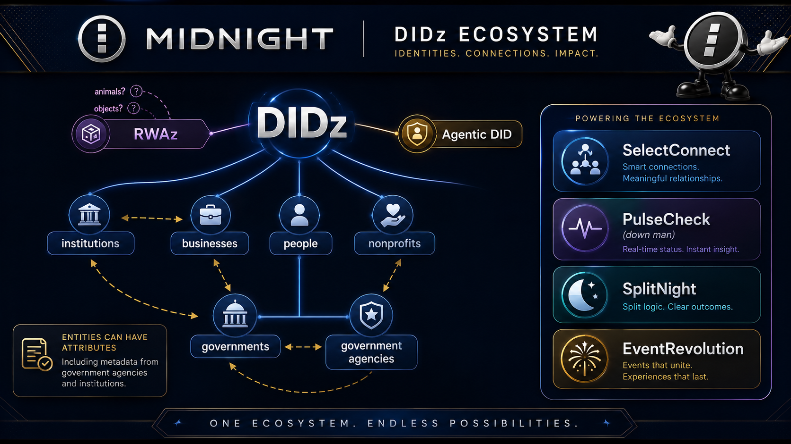

<div align="center">

# AgenticDID

### *The Identity Layer for the Agentic Web*

**Privacy-preserving decentralized identity for humans, AI agents, and objects — powered by zero-knowledge proofs on [Midnight Network](https://midnight.network).**

[](https://midnight.network)
[]()
[]()
[](./LICENSE)

**Domains**: AgenticDID.io · AgenticDID.me

</div>

---

## The Problem

AI agents are everywhere — shopping, scheduling, negotiating, managing portfolios. But how do you know the agent contacting your bank is *actually authorized by you*? How does the bank verify that without learning everything about you?

Traditional identity systems authenticate in one direction and expose everything. In an agentic world, that's a disaster.

## The Solution

AgenticDID gives every participant — human, AI agent, or smart object — a **cryptographically verifiable decentralized identifier (DID)** with zero-knowledge delegation proofs.

- A human authorizes an agent with a **delegation credential**
- The agent proves authority to any verifier via **ZK proof** — without revealing the human's identity
- **Multi-party mutual authentication** — both sides verify each other
- **Spoof transaction system** — 80% noise queries make it impossible for adversaries to distinguish real verifications
- **Listen In Mode** — toggle transparency to hear agent-to-agent communications in real-time

## Position in the DIDz Substrate

AgenticDID is the **Agent tier** of the [DIDz](https://github.com/bytewizard42i/didz-dapp-system) polymorphic identity substrate. DIDz is the universal foundation; each subject type plugs in as a tier on the same registry and trusted-issuer machinery.

| Tier | Subject | Vertical |
|------|---------|----------|
| **Human** | Individual people | DIDz.io, KYCz |
| **Organization** | Businesses, institutions, governments | DIDz.io org tier |
| **Agent** | Autonomous Ai agents | **AgenticDID** *(this repo)* |
| **Animal** | Living non-human subjects | PetProData, EquinePro |
| **Object / RWA** | Real-world assets and instruments | cross-cutting (Edda Labs RWA patterns) |

The Trust Triangle (Holder ↔ Trusted Issuer ↔ Verifier) is identical across all tiers. What changes per tier is the **binding primitive** (biometrics for humans, microchip/RFID for animals, serial number or cryptographic anchor for objects, delegation credentials chained from a principal for agents) and the **assertion vocabulary** (age and residency for humans, lineage and provenance for animals, capability and authority for agents). AgenticDID inherits trust from a DIDz human or organization principal via ZK delegation proofs, so an agent's authority is provably bounded by what its principal granted.

> One protocol, every entity type. AgenticDID ships the agent tier today.

See [DIDz Subjects table](https://github.com/bytewizard42i/didz-dapp-system#subjects-of-didz--who-or-what-can-have-an-identity) for the canonical tier definitions.

## What Makes AgenticDID Unique

| Feature | Description | Status |
|---------|-------------|--------|
| **Spoof Transactions** | 80% fake verification queries mask real activity — no other DID system has this | ✅ Implemented |
| **Listen In Mode** | Toggle real-time TTS of agent communications for full transparency | ✅ Implemented |
| **Results-Focused UX** | Users state goals ("Send $50"), system auto-selects the right agent | ✅ Implemented |
| **Mutual Authentication** | Bidirectional trust chains: User ↔ Agent ↔ Service | ✅ Implemented |
| **ZK Delegation Proofs** | Prove agent authority without revealing the delegator | 🔄 Phase 2 |

## Architecture

```
AgenticDID
├── agentic-did/                    # Core application
│   ├── contracts/                  # Compact smart contracts
│   │   ├── AgenticDIDRegistry.compact
│   │   ├── CredentialVerifier.compact
│   │   └── ProofStorage.compact
│   ├── docs/                       # Comprehensive documentation
│   │   ├── VISION_SUMMARY.md       # 3-minute overview
│   │   ├── AGENT_DELEGATION_WORKFLOW.md
│   │   ├── MIDNIGHT_INTEGRATION_PLAN.md
│   │   └── TWO_REPO_STRATEGY.md
│   ├── ai-studio-generated/        # Frontend components
│   ├── scripts/                    # Build, deploy, test
│   └── package.json
├── docs/
│   └── SELECTCONNECT_INTEGRATION.md
├── KYCZ_BINDING_STACK.md           # KYCz integration architecture
├── KYCZ_BIOMETRIC_VERIFICATION.md  # Biometric ZK proof design
└── PP_DIDZ_VISION_MANIFESTO.md     # DIDz Protocol vision
```

## Smart Contracts (Compact)

Three Midnight smart contracts form the on-chain identity layer:

- **AgenticDIDRegistry** — Register and manage DIDs for humans, agents, and objects
- **CredentialVerifier** — Verify delegation credentials with ZK proofs
- **ProofStorage** — Store and retrieve proof attestations on-chain

## Quick Start

```bash
git clone git@github.com:bytewizard42i/AgenticDID_io_me.git AgenticDID
cd AgenticDID/agentic-did
./docker-quickstart.sh
# Frontend: http://localhost:5175
# API: http://localhost:8787
```

**Try it:**
1. Click "Send $50" → Banker agent → ✅ Verified
2. Click "Book Flight" → Traveler agent → ✅ Verified
3. Toggle "Listen In Mode" → Hear agents communicate via TTS
4. Select Rogue agent → Any action → ❌ Revoked credential detected

## Roadmap

| Phase | What | When | Status |
|-------|------|------|--------|
| **Phase 1** | AI agent identity, spoof transactions, Listen In Mode | Q3 2025 | ✅ Complete |
| **Phase 2** | Human identity via DIDz, biometric ZK proofs, QR verification | Q1 2026 | 🔄 In Progress |
| **Phase 3** | Agentic commerce — declarative intents, agent marketplace | Q2 2026 | 📋 Planned |
| **Phase 4** | Cross-chain universal identity layer | Q3 2026 | 📋 Planned |
| **Phase 5** | Complete Fi ecosystem infrastructure | 2027+ | 🔮 Vision |

## Ecosystem Integration

AgenticDID is part of the **DIDz ecosystem** — 22 privacy-preserving products on Midnight:

| Integration | How |
|-------------|-----|
| **[DIDz.io](https://github.com/bytewizard42i/didz-dapp-system)** | Foundation identity protocol — AgenticDID extends DIDs to AI agents |
| **[KYCz](https://github.com/bytewizard42i/KYCz_us_app)** | Biometric verification layer for human-agent binding |
| **[realVote](https://github.com/bytewizard42i/realVote)** | Agents can vote on behalf of humans with delegation proofs |
| **[SelectConnect](https://github.com/bytewizard42i/selectConnect_app_pro)** | Safe contact sharing between agents and humans |
| **[DIDzMonolith](https://github.com/bytewizard42i/DIDzMonolith)** | Master orchestration repo for the full ecosystem |

## Documentation

- **[Vision Summary](./agentic-did/docs/VISION_SUMMARY.md)** — 3-minute overview of AgenticDID and the Fi ecosystem
- **[Agent Delegation Workflow](./agentic-did/docs/AGENT_DELEGATION_WORKFLOW.md)** — How humans delegate to agents
- **[Midnight Integration Plan](./agentic-did/docs/MIDNIGHT_INTEGRATION_PLAN.md)** — Real Midnight SDK integration
- **[Current Scope](./agentic-did/docs/CURRENT_SCOPE.md)** — What works now vs. what's coming
- **[KYCz Biometric Verification](./KYCZ_BIOMETRIC_VERIFICATION.md)** — Biometric ZK proof design for human-agent binding

---

**Built by**: [EnterpriseZK Labs LLC](https://enterprisezk.com) · John Santi
**Built with**: Alice 🌟, Cassie 💜, Cara ✨, Casie 🌙, and Penny 🎀

---

## DIDz Ecosystem

This project is part of the DIDz ecosystem — a suite of privacy-preserving
identity, credential, and application tools built on Midnight Network.



See the full ecosystem map above, or visit [didz.io](https://didz.io) for details.
