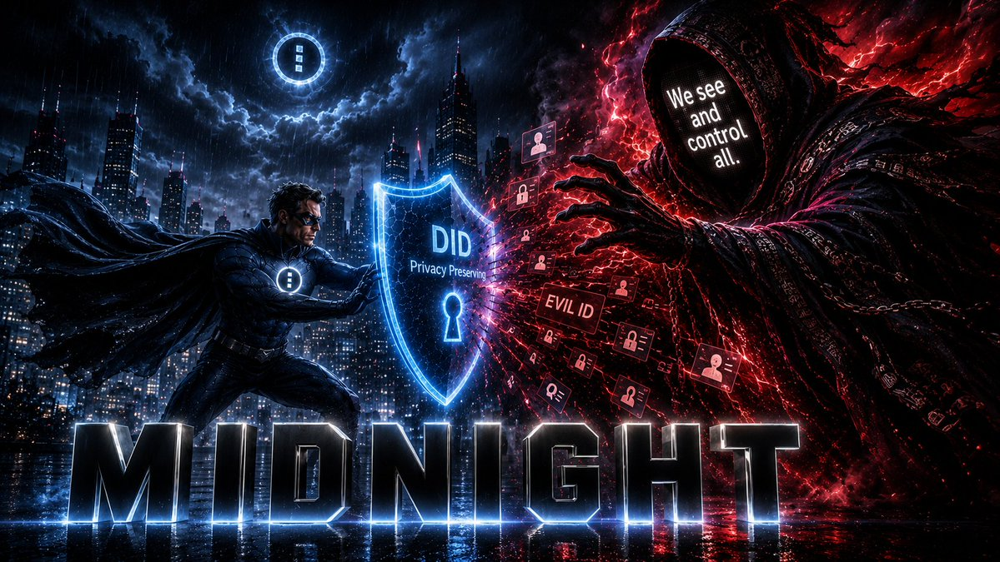

<div align="center">

# AgenticDID

### *The Identity Layer for the Agentic Web*

**Privacy-preserving identity, authority, and bounded delegation for Ai agents, powered by zero-knowledge proofs on [Midnight Network](https://midnight.network).**

[](https://midnight.network)
[]()
[]()
[](./LICENSE)

**Domains**: AgenticDID.io · AgenticDID.me

</div>

> **Midnight technical rule:** Follow the [DIDzM technical reference policy](../DIDzMonolith-docs/midnight/MIDNIGHT_TECHNICAL_REFERENCE_POLICY.md) for version-matched Compact syntax, SDK behavior, and evidence labels.

---

## The Problem

AI agents are everywhere, shopping, scheduling, negotiating, managing portfolios. But how do you know the agent contacting your bank is *actually authorized by you*? How does the bank verify that without learning everything about you?

Traditional identity systems authenticate in one direction and expose everything. In an agentic world, that's a disaster.

---

## The DIDzM Premise

The world's digital verification system is on its head. You must submit large
amounts of personal information to prove a single thing — something that is
really just a yes-or-no question:

> *Does this person meet this minimum (or maximum) requirement?*

Midnight flips this by answering **only the necessary question** with
mathematical certainty of truthfulness for the asker:

- Are you old enough?
- Are you a non-felon?
- Do you have an XYZ degree?
- Do you have a valid driver's license?
- Do you live within X miles of the job you are applying for?
- Do you have allergies?
- Do you have medical insurance?
- Do you qualify for this loan?
- Do you have a reputation for XYZ?
- Do you rightfully own this asset?
- Do you have the authority to open this door?

Every question above is a **yes or no**. Today, answering any one of them
requires surrendering your full identity, your documents, your history, and your
privacy to a stranger who will store it in a database that will eventually be
breached. DIDzM answers each with a zero-knowledge proof — mathematically
certain, cryptographically verifiable, and revealing **nothing** beyond the
answer itself. AgenticDID extends this same principle to **AI agents**: an agent
can prove it is authorized to act, without revealing by whom, for what, or how
much.

---

## The Solution

AgenticDID gives every participant, human, AI agent, or smart object, a **cryptographically verifiable decentralized identifier (DID)** with zero-knowledge delegation proofs.

- A human authorizes an agent with a **delegation credential**
- The agent proves authority to any verifier via **ZK proof**, without revealing the human's identity
- **Multi-party mutual authentication**, both sides verify each other
- **Spoof transaction system**, 80% noise queries make it impossible for adversaries to distinguish real verifications
- **Listen In Mode**, toggle transparency to hear agent-to-agent communications in real-time

## Position in the Four-Engine DIDzM System

AgenticDID is the agent-authority engine in DIDzM. It consumes root identity and
issuer primitives from DIDz, then owns scoped grants, delegation, attenuation,
revocation, and proof of authority for autonomous agents. It does not redefine
the DIDz root, RWAz ownership semantics, or HelixCTW data-layer behavior.

| Tier | Subject | Vertical |
|------|---------|----------|
| **Human** | Individual people | DIDz.io, KYCz |
| **Organization** | Businesses, institutions, governments | DIDz.io org tier |
| **Agent** | Autonomous Ai agents | **AgenticDID** *(this repo)* |
| **Animal** | Living non-human subjects | PetProData, EquinePro |
| **Object / RWA** | Real-world assets and instruments | cross-cutting (Edda Labs RWA patterns) |

The Trust Triangle (Holder ↔ Trusted Issuer ↔ Verifier) is identical across all tiers. What changes per tier is the **binding primitive** (biometrics for humans, microchip/RFID for animals, serial number or cryptographic anchor for objects, delegation credentials chained from a principal for agents) and the **assertion vocabulary** (age and residency for humans, lineage and provenance for animals, capability and authority for agents). AgenticDID inherits trust from a DIDz human or organization principal via ZK delegation proofs, so an agent's authority is provably bounded by what its principal granted.

> One system, four engines. AgenticDID owns agent identity and authority.
> Shipping and implementation claims below refer to repository prototypes unless
> a reproducible build, test, and deployment record is linked.

See [DIDz Subjects table](https://github.com/bytewizard42i/didz-dapp-system#subjects-of-didz--who-or-what-can-have-an-identity) for the canonical tier definitions.

## What Makes AgenticDID Unique

The status labels in this table describe repository feature implementations and
demos. They are not, by themselves, evidence of audited or production deployment.

| Feature | Description | Status |
|---------|-------------|--------|
| **Spoof Transactions** | 80% fake verification queries mask real activity, no other DID system has this | ✅ Implemented |
| **Listen In Mode** | Toggle real-time TTS of agent communications for full transparency | ✅ Implemented |
| **Results-Focused UX** | Users state goals ("Send $50"), system auto-selects the right agent | ✅ Implemented |
| **Mutual Authentication** | Bidirectional trust chains: User ↔ Agent ↔ Service | ✅ Implemented |
| **ZK Delegation Proofs** | Prove agent authority without revealing the delegator | 🔄 Phase 2 |

## Architecture

```
AgenticDID
├── agentic-did/                    # Core application
│   ├── contracts/                  # Compact smart contracts
│   │   ├── AgenticDIDRegistry.compact
│   │   ├── CredentialVerifier.compact
│   │   └── ProofStorage.compact
│   ├── docs/                       # Comprehensive documentation
│   │   ├── VISION_SUMMARY.md       # 3-minute overview
│   │   ├── AGENT_DELEGATION_WORKFLOW.md
│   │   ├── MIDNIGHT_INTEGRATION_PLAN.md
│   │   └── TWO_REPO_STRATEGY.md
│   ├── ai-studio-generated/        # Frontend components
│   ├── scripts/                    # Build, deploy, test
│   └── package.json
├── docs/
│   └── SELECTCONNECT_INTEGRATION.md
├── KYCZ_BINDING_STACK.md           # KYCz integration architecture
├── KYCZ_BIOMETRIC_VERIFICATION.md  # Biometric ZK proof design
└── PP_DIDZ_VISION_MANIFESTO.md     # DIDz Protocol vision
```

## Smart Contracts (Compact)

Three Midnight smart contracts form the on-chain identity layer:

- **AgenticDIDRegistry**, Register and manage DIDs for humans, agents, and objects
- **CredentialVerifier**, Verify delegation credentials with ZK proofs
- **ProofStorage**, Store and retrieve proof attestations on-chain

## Quick Start

```bash
git clone git@github.com:bytewizard42i/AgenticDID_io_me.git AgenticDID
cd AgenticDID/agentic-did
./docker-quickstart.sh
# Frontend: http://localhost:5175
# API: http://localhost:8787
```

**Try it:**
1. Click "Send $50" → Banker agent → ✅ Verified
2. Click "Book Flight" → Traveler agent → ✅ Verified
3. Toggle "Listen In Mode" → Hear agents communicate via TTS
4. Select Rogue agent → Any action → ❌ Revoked credential detected

## Roadmap

| Phase | What | When | Status |
|-------|------|------|--------|
| **Phase 1** | AI agent identity, spoof transactions, Listen In Mode | Q3 2025 | ✅ Complete |
| **Phase 2** | Human identity via DIDz, biometric ZK proofs, QR verification | Q1 2026 | 🔄 In Progress |
| **Phase 3** | Agentic commerce, declarative intents, agent marketplace | Q2 2026 | 📋 Planned |
| **Phase 4** | Cross-chain universal identity layer | Q3 2026 | 📋 Planned |
| **Phase 5** | Complete Fi ecosystem infrastructure | 2027+ | 🔮 Vision |

## Ecosystem Integration

AgenticDID is part of the **DIDz ecosystem**, 22 privacy-preserving products on Midnight:

| Integration | How |
|-------------|-----|
| **[DIDz.io](https://github.com/bytewizard42i/didz-dapp-system)** | Foundation identity protocol, AgenticDID extends DIDs to AI agents |
| **[KYCz](https://github.com/bytewizard42i/KYCz_us_app)** | Biometric verification layer for human-agent binding |
| **[realVote](https://github.com/bytewizard42i/realVote)** | Agents can vote on behalf of humans with delegation proofs |
| **[SelectConnect](https://github.com/bytewizard42i/selectConnect_app_pro)** | Safe contact sharing between agents and humans |
| **[DIDzMonolith](https://github.com/bytewizard42i/DIDzMonolith)** | Master orchestration repo for the full ecosystem |

## Documentation

- **[Vision Summary](./agentic-did/docs/VISION_SUMMARY.md)**, 3-minute overview of AgenticDID and the Fi ecosystem
- **[Agent Delegation Workflow](./agentic-did/docs/AGENT_DELEGATION_WORKFLOW.md)**, How humans delegate to agents
- **[Midnight Integration Plan](./agentic-did/docs/MIDNIGHT_INTEGRATION_PLAN.md)**, Real Midnight SDK integration
- **[Current Scope](./agentic-did/docs/CURRENT_SCOPE.md)**, What works now vs. what's coming
- **[KYCz Biometric Verification](./KYCZ_BIOMETRIC_VERIFICATION.md)**, Biometric ZK proof design for human-agent binding

---

**Built by**: [EnterpriseZK Labs LLC](https://enterprisezk.com) · John Santi
**Built with**: Alice 🌟, Cassie 💜, Cara ✨, Casie 🌙, and Penny 🎀

---

## DIDz Ecosystem

This project is part of the DIDz ecosystem, a suite of privacy-preserving
identity, credential, and application tools built on Midnight Network.


See the full ecosystem map above, or visit [didz.io](https://didz.io) for details.

---

## The Existential Threat



The convergence of autonomous Ai, mass surveillance, and centralized identity databases creates an existential threat to human autonomy. Every digital interaction becomes a data point in someone else's database. Every Ai agent operates without verifiable accountability. Every centralized identity system is a breach waiting to happen.

**DIDzMonolith is the architectural answer.** Four engines, one ecosystem, zero-knowledge proofs on Midnight Network:

| Engine | Role | What It Proves |
|--------|------|----------------|
| **DIDz** | Root identity layer | Who you are, without revealing who you are |
| **AgenticDID** | Agent authority layer | That an Ai agent is authorized, without revealing by whom |
| **RWAz** | Object/asset identity layer | What an asset is and who owns it, without exposing ownership data |
| **HelixCTW** | Data-layer engine | Query and manage private data, without exposing raw facts |

**This project** is part of the DIDzMonolith ecosystem, built on these four engines. The existential threat is real. The architecture is ready.

---

## Regulatory Compliance

This project is part of the DIDzMonolith ecosystem and inherits the four-engine ZK architecture (DIDz + AgenticDID + RWAz + HelixCTW) that provides privacy-by-design advantages for regulatory compliance.

**Applicable frameworks**: SOC 2, ISO 27001, PCI DSS, HIPAA, MiCA — depending on product function and jurisdiction.

**Full compliance deep dive**: [`DIDzMonolith-docs/compliance/REGULATORY_COMPLIANCE_DEEP_DIVE.md`](../DIDzMonolith-docs/compliance/REGULATORY_COMPLIANCE_DEEP_DIVE.md) — engine-by-engine control mappings, product compliance matrix, and implementation roadmap.

**MiCA regulatory notes**: [`DIDzMonolith-docs/compliance/MICA_REGULATORY_NOTES.md`](../DIDzMonolith-docs/compliance/MICA_REGULATORY_NOTES.md) — EU crypto-asset regulation product-by-product matrix.

---
